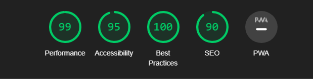

# Azure ADB2C Integration and Customization

This project is a Proof of Concept (PoC) that demonstrates how to integrate Azure Active Directory B2C (ADB2C) into a React/Nextjs application without using external packages like @msal/react. It also showcases how to customize the AD user interfaces also in a React/Nextjs application.

> **NOTE:** This README is also a WIP and **_might_** not be 100% accurate.

## Problem Statement

The integration of Azure ADB2C into React applications is possible through packages like @msal/react. However, these packages primarily focus on authentication rather than providing customization options for the login and signup pages. To customize these pages, developers are left with the task of writing HTML with internal CSS and JavaScript, which can be time-consuming and restrictive due to the limitation of relying on internal stylesheets and scripts.

Most projects create their own design systems and component libraries which they use in all of their apps but due to restrictive nature of ADB2C, these components cannot be directly used. So, they end up creating their [HTML template](https://learn.microsoft.com/en-us/azure/active-directory-b2c/customize-ui-with-html?pivots=b2c-user-flow) or have to engineer some solution that would allow them to customize these interfaces with their favorite styling solutions/component libraries.

## Solution

This PoC addresses the limitation by providing a solution that allows developers to customize the login and signup pages of Azure ADB2C using different styling solutions. It consists of three applications: signin, signup and b2c-vanilla. The signin and signup apps are responsible for customizing the Azure ADB2C signin and signup pages respectively, while the b2c-vanilla application is just to demonstrate the integration of Azure ADB2C without relying on a third-party library like MSAL.

## Application Details

`signin` & `signup`: They are Nextjs apps designed to demonstrate how to customize Azure's signin and signup pages using various CSS solutions. The motivation behind this is to show the flexibility of different styling solutions for customization purposes. The following CSS solutions are used:

- Chakra UI
- CSS Modules
- Styled-jsx
- TailwindCSS

They contain a DummyApi component, which is an exact replica of the ADB2C's UI API. This component serves as a local environment for testing and previewing the customizations made to the sigin and signup pages. After deploying these apps which also contains a script, the customizations are automatically applied to the actual ADB2C's actual UI API in production.

`b2c-vanilla`: The b2c-vanilla app demonstrates how to integrate Azure ADB2C without relying on a third-party library like MSAL provided by Azure. This app contains a navigation bar and a login button. Clicking the login button redirects the user to the customized interface. Once the user logs in, the login button changes to a logout button.

## Getting Started

1. Install dependencies:

```sh
pnpm install
```

2. To run the `signin` app:

```sh
pnpm dev:signin
```

3. Similarly, to run the `signup` app:

```sh
pnpm dev:signup
```

4. To run the `b2c-vanilla` app:

```sh
pnpm dev:b2c
```

> **NOTE:** Do not foget to add the AD based configs in apps/b2c-vanilla/authConfig.ts

5. To build all the workspaces (apps and shared packages),

```sh
pnpm build
```

## Deployment

- After the customization inside of `app` app, run the `build` command and deploy it to your favourite service. (I have used Vercel for this PoC).
- Take the deployment url and provide it to ADB2C's Page as the `Custom Page URI` in Page Layouts.

## Lighthouse

- Following is the lighthouse score for both the signin and signout pages:



## Roadmap

The immediate roadmap items are mostly optimazation for now:

- **Styles**: Add fonts
- **Script**: Make the translation algorithm more robust
- **With MSAL**: Integration with @msal/react
- **Config**: Make the solution generic (if possible) and configurable (plugin and use)
